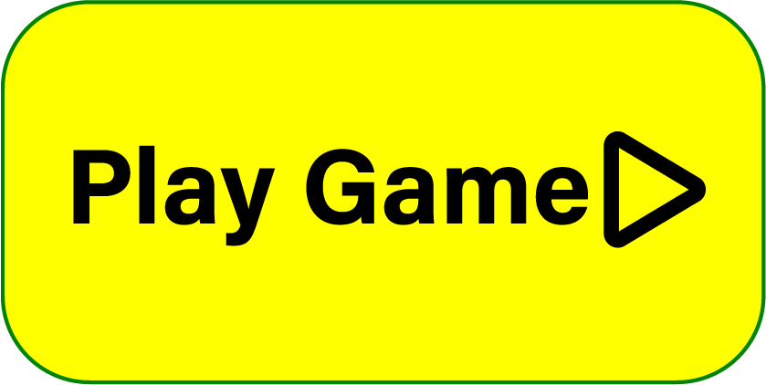

    
        <h1>The Laser Space Game | A Javascript project</h1>   
        
Embark on a space mission and try to win the alien with your lasers shoots.

  <a href="#description">Description</a> •
  <a href="#how-to-play">How To Play</a> •
  <a href="#main-features">Main features</a> •
  <a href="#technologies-used">Technologies used</a> •
  <a href="#contact">Contact</a>

# The Laser Space Game

## Description  

Basic JavaScript Project by Arianna Pesce | Front-End Development | start2impact University

Visit the site:
https://pescearianna.github.io/Progetto-JavaScript-di-Arianna-Pesce/

**"Laser Space Game"** is an interactive game. The player is challenged to destroy an alien using a space weapon before its life exceeds the maximum limit.  

---  

## How to Play  

1. Press **Start** to begin the game.  
2. Use the **Shoot** button to attack the enemy.  
3. Keep an eye on the ammo: use the **Reload** button to recharge when it's 0.  
4. Win by defeating the monster before its life reaches 50.  

---

## Main Features  

- **Enemy Life System**: The monster's life increases by 10 every 5 seconds, up to a maximum of 50.  
- **Reload Mechanic**: After every 10 shots, the player must reload the weapon.  
- **Victory or Defeat**: Win by reducing the monster's life to 0, lose if its life exceeds 50.  
- **Responsive Design**: Compatible with mobile and desktop devices.  
- **Javascript buttons**: All buttons are created through the DOM manipulation.

---  

## Technologies Used  

- **HTML**: For the game structure.  
- **CSS**: For styling and animations.  
- **JavaScript**: For logic and interactions.  

---  

## Contact

> GitHub [@pescearianna](https://github.com/pescearianna) &nbsp;&middot;&nbsp;
> LinkedIn [Arianna Pesce](https://www.linkedin.com/in/ariannapesce/)

---
